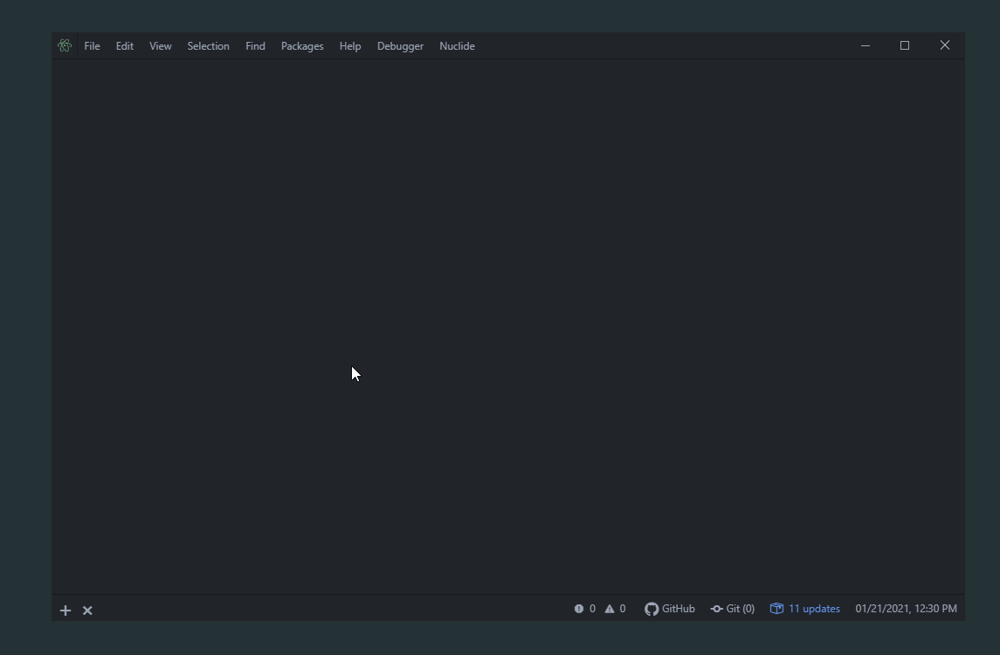

# Atom Windows Titlebar

The titlebar replacement for Atom on Windows 10

Slightly edited version of https://atom.io/packages/atom-windows-titlebar

Edits:
 - Menu Bar now also matches theme
 - Menu Dropdowns are stylized to match theme
 - Slight coloring changes for Maximize/Minimize/Close buttons

## Matches titlebar with Theme

## How it works
You need to enable/disable windows default frame!

### 1. Close Atom
make sure all atom windows are closed

### 2. Terminal/CMD to your atom/app-X.XX.X folder
run `cd C:\Users\{user}\AppData\Local\atom\app-{version}`

### 3. npm install asar
run `npm install asar`

### 4. node toggleframe.js
run `node toggleframe.js`

### 5. Open atom!
Open atom!
